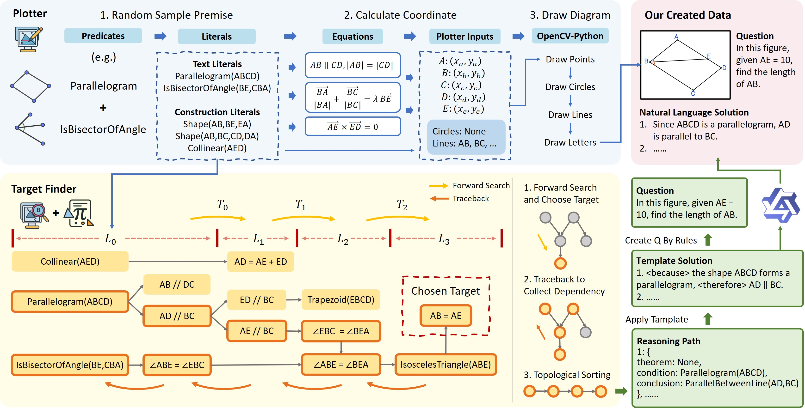

# GeoGen

A pipeline for the automatic construction of geometry problems along with step-by-step solutions.

<!-- This repo is the implementation of our paper:  -->

## Features

- GeoGen can automatically synthesize geometry diagrams.
- GeoGen can generate questions and step-by-step solutions by incorporating symbolic systems, applied to both public datasets (Geometry3K, PGPS9K) and our synthetic data.
- GeoGen is inspired by [AlphaGeometry](https://github.com/google-deepmind/alphageometry), and leverages [FormalGeo](https://github.com/FormalGeo/FormalGeo) as the underlying symbolic system.



## Getting Started

```bash
conda create -n geogen python=3.9
conda activate geogen
git clone https://github.com/ycpNotFound/GeoGen.git
cd GeoGen
pip install -r requirements.txt
```

## Core components
```bash
GeoGen/
│
├── generator.py        # Randomly sample premise and generate literals
├── allocator.py        # Assign coordinates for literals
├── plotter.py          # Draw with geometry diagram
├── solver.py           # symbolic solver with our improved forward-search
├── target_finder.py    # Conduct reasoning, find target and create question & answer
└── ...
```

## Datasets

We collect symbolic annotations for most of the diagrams from Geometry3K and PGPS9K, as listed in `datasets_info`. Note that symbolic reasoning can be conducted without relying on images. For Geometry3K, we utilize annotations from `formalgeo7k`, which provides detailed symbolic annotations for public datasets from [FormalGeo](https://github.com/FormalGeo/FormalGeo). For PGPS9K, we use regularization tools and prompt LLMs to convert the source annotations into the required symbolic format. Since the annotations are constructed automatically, some omissions may occur. However, these do not affect the overall workflow.

You can download images and original annotations for Geometry3K from [Inter-GPS](https://github.com/lupantech/InterGPS).

You can download images and original annotations for PGPS9K from [PGPS](https://github.com/mingliangzhang2018/PGPS).

## Create Q&A for Geometry3K & PGPS9K

Run `main_search_public.py` with multiprocessing to expand more target and create question & answer from public dataset (geometry3K and PGPS9K). 

```bash
python main_search_public.py \
    --dataset_name geo3k \ # or pgps9k 
    --save_dir /path/to/your/dir \
    --num_process 12 \
    --seed 1234 \
    --debug False
```

## Synthesize Geometry Diagram and Create Q&A

Run `main_search_synth.py` with multiprocessing to synthesize geometry diagram and create question & answer for it, with one Q&A pair for each diagram.

```bash
python main_search_synth.py \
    --save_dir /path/to/your/dir \
    --num_process 12 \
    --seed 1234 \
    --debug False \
    --use_default_sampling_num True
    # you can disable this para and modify the sampling num in python sript.
```

## Acknowledgement

GeoGen is based on [FormalGeo](https://github.com/FormalGeo/FormalGeo), released under the MIT License. We extend its symbolic reasoning engine to support automatic diagram generation and reasoning path synthesis.

We also draw inspiration from [AlphaGeometry](https://github.com/google-deepmind/alphageometry) in designing our pipeline.
